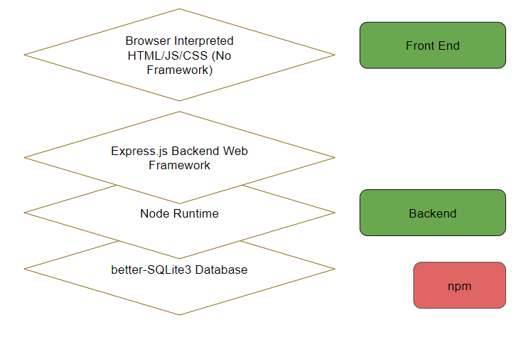
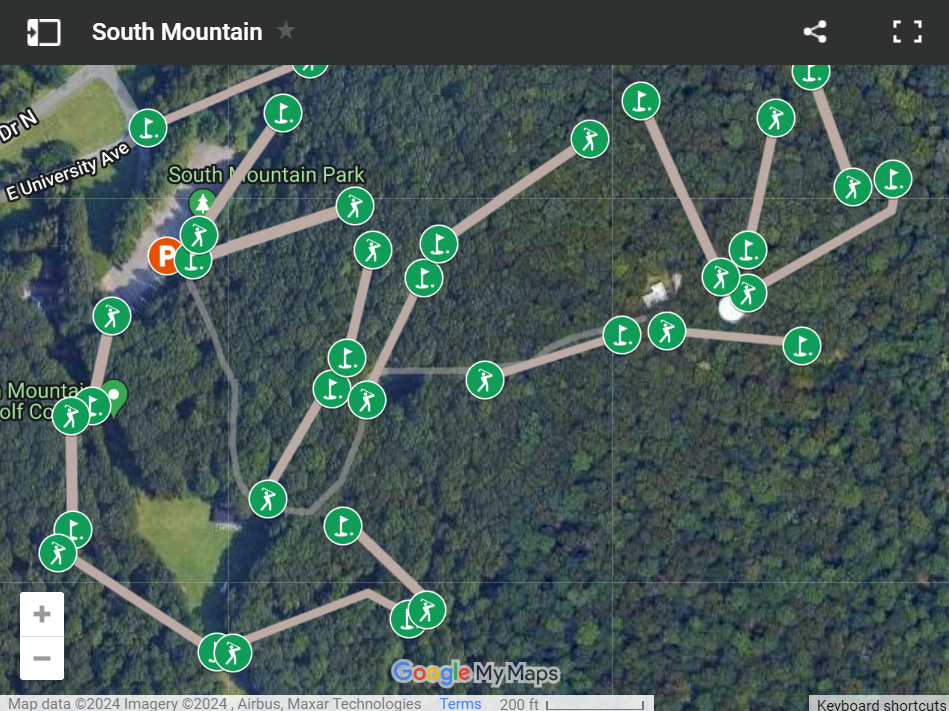
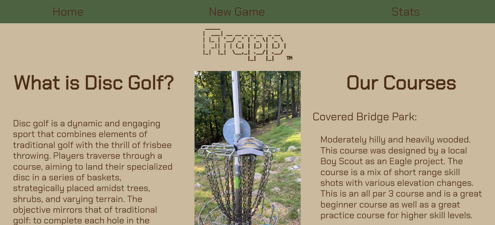
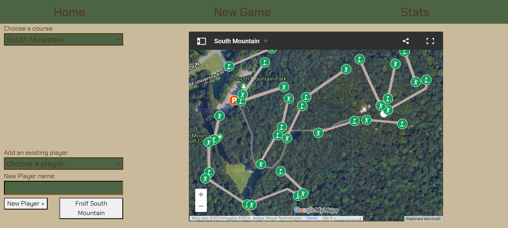
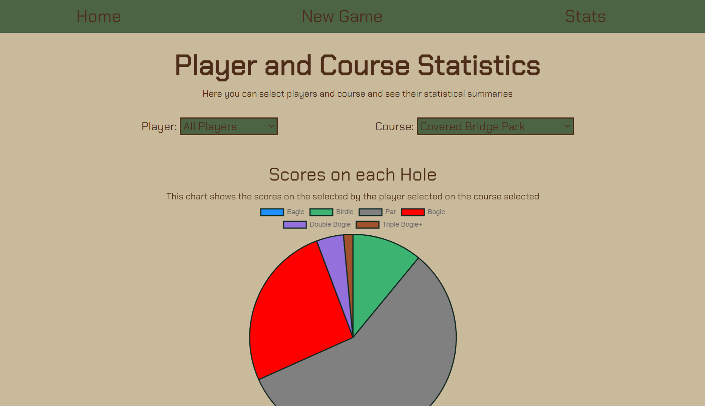
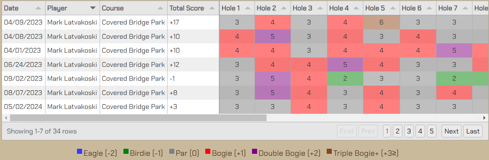

                 _____
                |  ___| __ __ _ _ __  _ __
                | |_ | '__/ _' | '_ \| '_ \
                |  _|| | | (_| | |_) | |_) |
                |_|  |_|  \__,_| .__/| .__/
                               |_|   |_|    

# Frapp Disc Golf Tracker and Statistics App

* This Disc Golf Tracker App was built as a final project submission for the Web Systems Programming Class at Lehigh University (CSE 264). It uses the express.js framework, and an SQLite3 Database. It is written in HTML/CSS/JS, and can be run with Node. npm can be used to install our dependencies. We also use Google My Maps to display the Course to the user.

## Pages

Our app has a simple 3 page layout:

## Usage

### Navigation
* Our App Opens to the Home page (on the Left above), Where you can read about our courses and the game.
* From Here, use the top bar to navigate to the New Game Tab. (in Center above) Here you can start a new game. Select a course from the course list. Then add players using the dropdown, or typing in the new players box. South Mountain and Moore include an interactive Google My Map imbed. Click Frolf, and you will be directed to our play page. Here you can enter a score. Pars are auto populated. When the first scores are entered, a leaderboard and scorecard will display on the right. These will be displayed during the duration of the game for conveinence. Once all scores are entered, the app will display the leaderboard and scorecard before redirecting to the homepage.
* From Here, use the top bar to navigate to the Stats tab. (Shown at right above) Here you can see statistics of all previous games. Use the dropdowns at the top to select a combonation of courses and players, and watch as the graphs change with animation. The Bar Chart is useful to compare different players at a course, and the pie chart is a good way to see individual player performace on a particular hole. Also see the score listings at the bottom for a full archive.

### Local Setup

1. Clone our project.
2. Navigate to this directory (with the readme)
3. run `npm install`
4. run our app with node with `node .\app.js`
5. See our app running at http://localhost:3000

### Database
Most app data and functionality is detemined by entries in our database. This can be setup by a new user by adding one entry to our database. After playing one round, note our database structure in ./rounds.csv. Add a few lines, following the structure of the database. This will add the courses and players to the dropdowns, and our app and stats will be fully functional for subsequent rounds.

## Future

* New Rounds are temporarily not sent to database (for presentation)
* Mobile App Coming Soon?!

## Contributors

* Mark Latvakoski CSE '24
* Isaac Levine CompE '25

